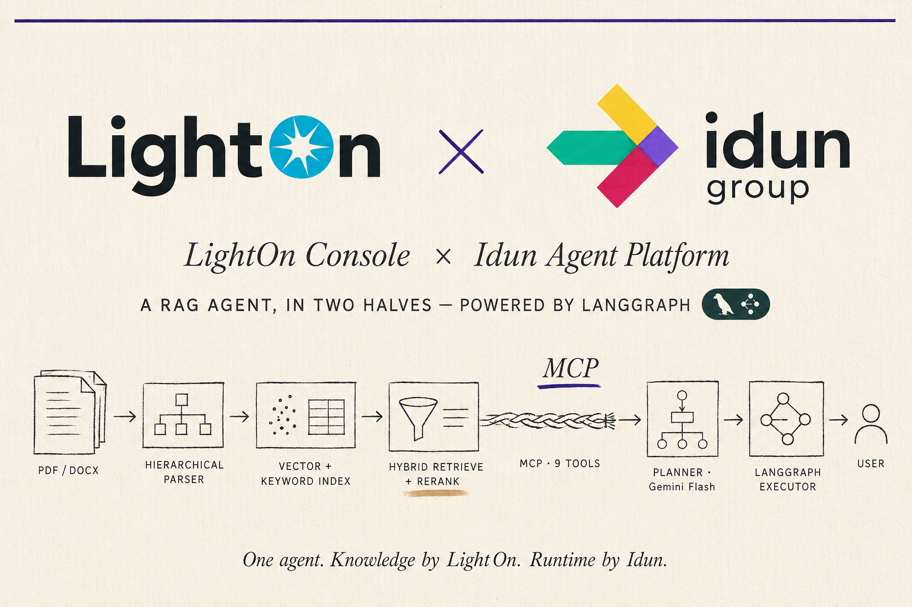

<p align="center">
  </a>

<h1 align="center">LightOn x Idun RAG Agent</h1>

A document assistant connecting [LightOn Console](https://www.lighton.ai) (knowledge layer) to [Idun Agent Platform](https://cloud.idunplatform.com) (agent runtime), via a LangGraph agent powered by Gemini.

Full write-up: [`docs/blog/lighton-x-idun-rag-agent.md`](docs/blog/lighton-x-idun-rag-agent.md).

## Structure

```
sdk/
  client.py       Console v3 API client
  models.py       Pydantic response models
  exceptions.py   Custom exceptions
  tests/          Unit and integration tests
mcp_server.py     MCP server exposing the SDK as tools
agent.py          LangGraph agent (planner + executor)
```

## Setup

Requires Python 3.12 and [uv](https://docs.astral.sh/uv/).

```bash
uv sync
```

Create `.env`:

```
LIGHTON_API_KEY=your_lighton_key
GOOGLE_API_KEY=your_gemini_key
```

## Run the MCP server

```bash
uv run python mcp_server.py
```

Listens on `http://127.0.0.1:8000/mcp`. Expose with ngrok if Idun Cloud needs to reach it.

## Configure the agent in Idun Cloud

At [cloud.idunplatform.com](https://cloud.idunplatform.com):

1. Create a LangGraph agent, graph definition `agent.py:graph`
2. Add the MCP server (streamable HTTP, URL + `/mcp`)
3. Create `system-prompt` and `plan-prompt`, assign both to the agent (prompt text in the blog post)

## Tests

```bash
uv run pytest sdk/tests/test_unit.py          # mocked, fast
uv run pytest sdk/tests/test_integration.py   # live API
```
