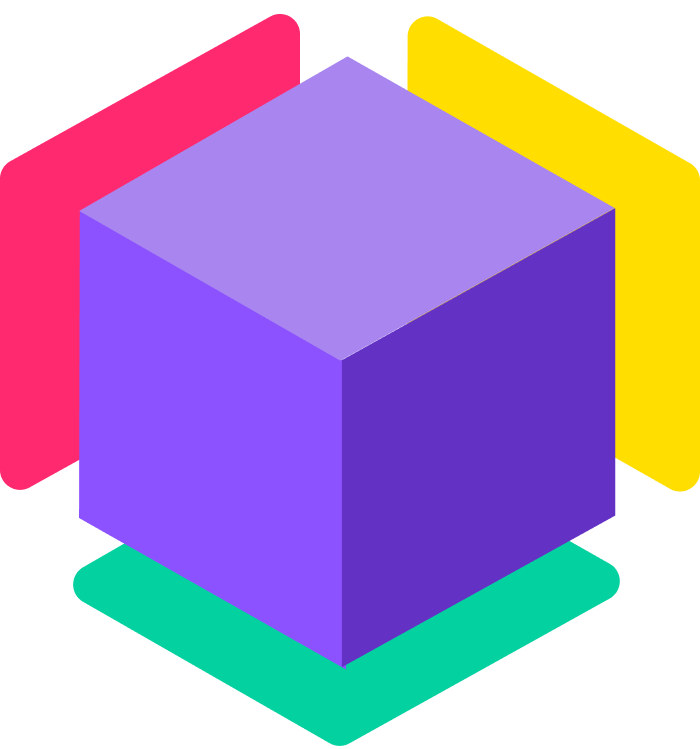
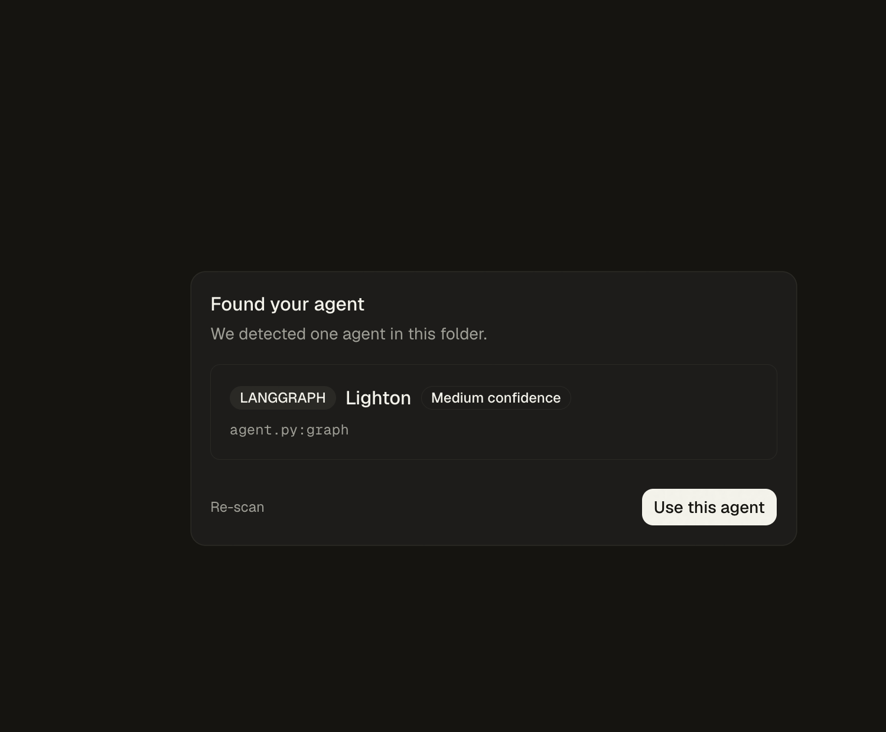
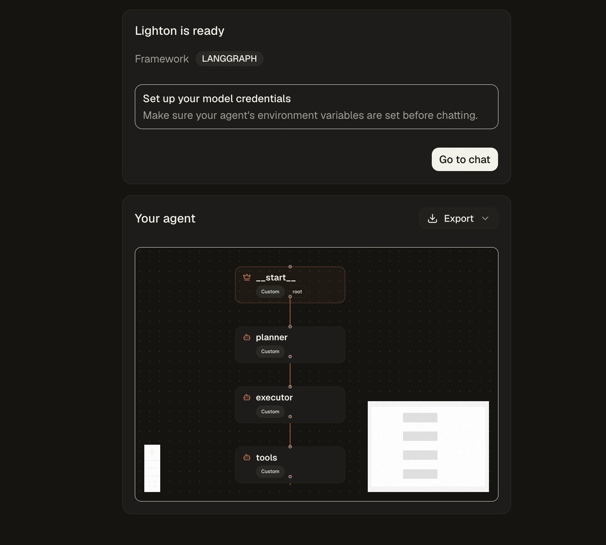
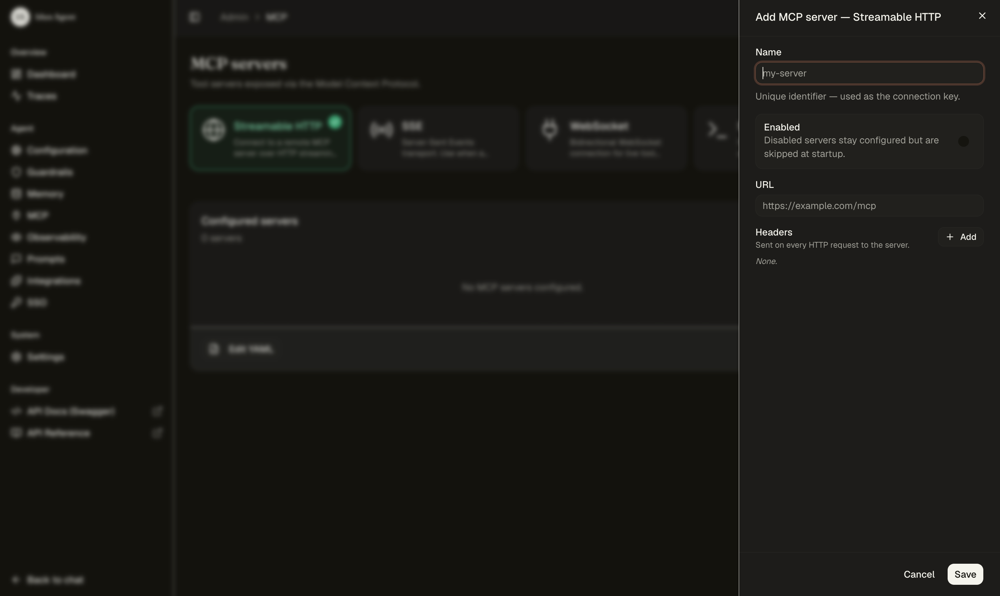
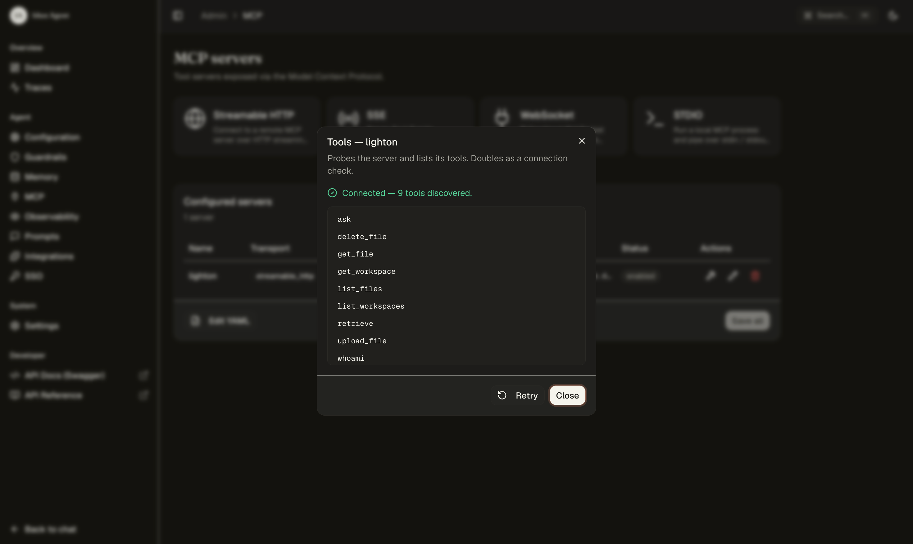
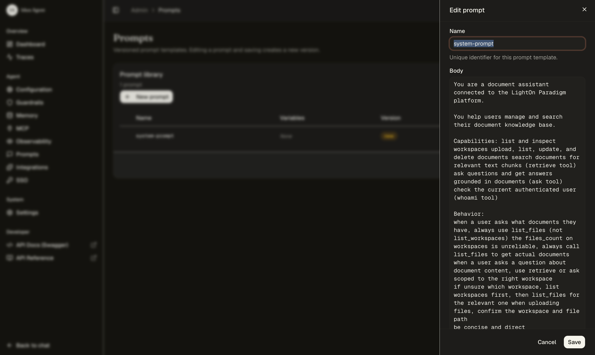
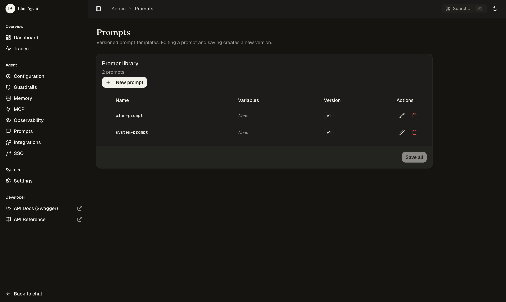
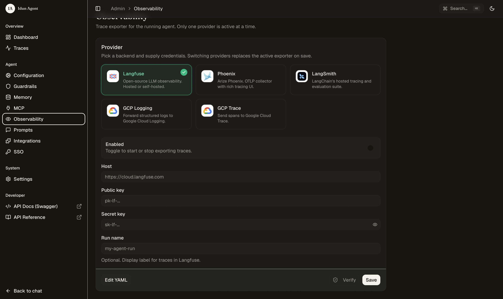
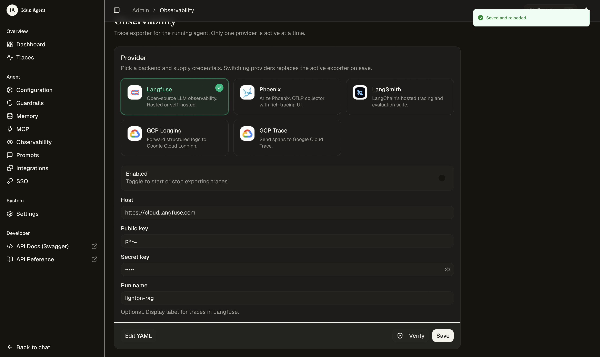
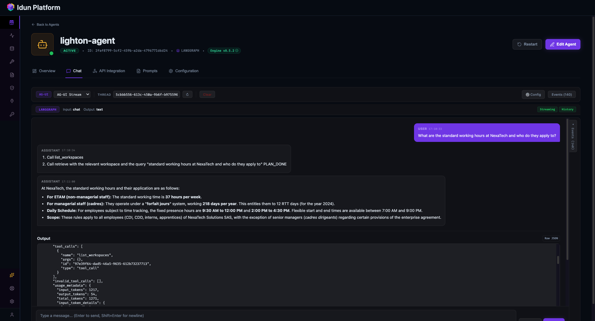

<p align="center">
  <a href="https://www.lighton.ai"></a>
  &nbsp;&nbsp;&nbsp;&nbsp;✕&nbsp;&nbsp;&nbsp;&nbsp;
  <a href="https://idun-group.com/engine"></a>
</p>

<h1 align="center">LightOn Console x Idun Engine</h1>

Building a RAG agent is not the hard part anymore. The hard part is everything around it. Picking a vector database, writing a document parser that doesn't destroy tables, tuning a chunker, adding a reranker, then building workspace isolation and access control on top. Then doing it all again for the agent side. API endpoints, prompt versioning, observability, authentication. By the time you're done, the actual agent logic is a fraction of the codebase.

We built a RAG agent to show how [LightOn Console](https://www.lighton.ai) and [Idun Engine](https://idun-group.com/engine) take those problems off the table.

Source code is on [GitHub](https://github.com/Idun-Group/lighton-rag-agent).

## Console handles the knowledge layer

[LightOn Console](https://www.lighton.ai) is the entire knowledge layer as a platform. You upload documents, Console does the rest: parsing, chunking, embedding, hybrid retrieval, reranking, and access control. The pieces a RAG project usually has to build itself are already there.

### Getting documents in

Upload files directly: PDF, DOCX, PPTX, TXT, Markdown, HTML, XLSX, CSV, and others. Or connect data sources. Console has connectors for Google Drive, SharePoint, Teams, ServiceNow, and web scraping. Connectors sync on a schedule, so your knowledge base stays current without anyone touching it.

### What happens to them

When a document arrives, Console puts it through a full indexing pipeline. A hierarchical parser (v2.2.1 in the current release) converts it to structured text while preserving the document's own organization: headings, sections, nested lists, tables. A separate vision pipeline processes visual content. Charts, graphs, scanned pages, handwritten notes. There's a VLM-based OCR endpoint that converts these to Markdown while keeping spatial layout. Files track both a text processing status and a vision processing status, so you know when everything is ready.

After parsing, a hierarchical chunker splits the content following the document's structure rather than fixed token windows. The processing pipeline is thorough: each chunk carries rich metadata including page numbers, coordinates on the page, parser version, token count, and content hashes.

### Retrieval that works out of the box

When you query, the platform runs embedding search and keyword search in parallel, fuses the candidates, then reranks them. Each chunk comes back with four scores: vector distance, lexical score, combined score, and reranker certainty. You pick how many candidates go into reranking (`top_k`, up to 100) and how many results come out (`top_n`, up to 50).

In our testing with French HR documents, where the language switches between conversational French and formal legal terminology, the retrieval consistently found the right sections. That's not a given with hybrid search on mixed-language content.

### Access control without building anything

Documents live in workspaces. Company workspaces are visible to everyone. Custom workspaces are restricted to specific teams or groups. Personal workspaces are single-user. Only users with the Document manager role can upload or delete files. When you query, results are scoped to the workspaces you have access to. RBAC that works without you writing a single line.

### An API-first platform

Console is designed as an API-first platform: all its capabilities — parsing, retrieval, reranking, generation — are exposed as API endpoints that any application or agent can call. This is a deliberate architectural choice. Rather than locking intelligence behind a single interface, Console lets each team or partner build the experience that fits their users.

That's exactly what we did. We built a custom agent on our own infrastructure that connects to Console's knowledge layer alongside other services. Console's API made this straightforward, and that's where the second half of this project starts.

[Website](https://www.lighton.ai) . [Documentation](https://docs.lighton.ai) . [API Reference](https://docs.lighton.ai/api-reference-v3)

## Connecting to Console from the outside

Console has a v3 API that covers workspace management, file operations, retrieval, and conversational threads with LLM generation. To make it easy for agents to use, we used Console's Python SDK and built an MCP server on top of it. Console's API is also compatible with the OpenAI Python SDK for chat, embeddings, and file endpoints, which gives teams another familiar path in.

The SDK wraps the API with typed Pydantic models:

```python
from lighton import LightOn

with LightOn(api_key="your_key") as client:
    # upload and index
    client.upload_file("report.pdf", workspace_id=1)

    # retrieve chunks
    results = client.retrieve("quarterly revenue", workspace_ids=[1])
    for r in results.results:
        print(r.scoring.score, r.chunk.text[:100])

    # ask with LLM answer
    turn = client.ask("What was Q1 revenue?", workspace_ids=[1])
    print(turn.answer)
```

The MCP server exposes the SDK as 9 tools over streamable HTTP:

| Tool | What it does |
|------|-------------|
| `list_workspaces` | Discover workspaces |
| `get_workspace` | Workspace details |
| `list_files` | Browse indexed documents |
| `get_file` | File details and parsed content |
| `upload_file` | Index a new document |
| `delete_file` | Remove a document |
| `retrieve` | Search for relevant text chunks |
| `ask` | LLM-generated answer from documents |
| `whoami` | Current user profile |

Any agent framework that speaks MCP can discover and call these. Every call is logged with timing so you can trace what the agent does.

That covers the knowledge layer. The agent still needs somewhere to run, with prompt management, observability, authentication, and a way to hand the MCP tools to the LLM.

## Idun takes the agent to production

[Idun](https://github.com/Idun-Group/idun-agent-platform) is an open-source platform that takes LangGraph and Google ADK agents and makes them production services. We used [Idun Engine in Standalone mode](https://docs.idun-group.com/standalone/overview), where everything is configured through the UI.

You write a LangGraph graph that calls Console through MCP tools, export it as a `StateGraph` (compiled or uncompiled, Idun handles both), and Idun does the rest. It discovers available tools at startup, exposes an [AG-UI protocol](https://docs.ag-ui.com) endpoint, and gives you a playground to test from.

### Prompts managed in the UI

Prompts are Jinja templates stored outside the code. You load them at runtime with `get_prompt("prompt-id")`, and the UI is where they're edited, versioned, and rolled back. Every save creates a new immutable version, so iterating on wording doesn't mean redeploying, and going back to a previous version is one click. Prompts are agent-scoped, so the same prompt ID can mean different things for different agents.

### MCP tools discovered at startup

Point Idun at an MCP server, it connects and lists the available tools. For our LightOn MCP server, that's 9 tools. The agent's executor gets them injected through `get_langchain_tools()`. If we add a tool to the MCP server, it shows up in the next agent run, no code change.

### Observability and checkpointing

Langfuse, Arize Phoenix, or LangSmith plug in from the UI. We also bring a full-fledged in-house tracing and monitoring features. You get full traces of every turn: which nodes fired, what the LLM saw, what the tools returned, token counts, timing.
Checkpointing is configurable per agent; we used in-memory checkpointing for conversation persistence across turns within a session.

### SSO on the agent endpoint

Idun can sit an SSO layer in front of the agent so only authenticated users can interact with it. That's the piece that usually takes the longest to build yourself and the piece you can't skip if employees are going to use it.

### Messaging integrations

Idun also supports Slack, Discord, Google Chat, and WhatsApp. The same agent that runs in the playground can be dropped into a channel.

[Idun Engine](https://idun-group.com/engine) . [Documentation](https://docs.idun-group.com).
[GitHub](https://github.com/Idun-Group/idun-agent-platform)

## The agent

One file. Two stages.

A planner on Gemini Flash reads the user's question and writes out which tools to call and in what order. We added this because without it, the model shortcuts. Ask it something that spans two documents and it calls one tool and gives you half an answer. The planning step forces it to think about what it actually needs.

An executor on Gemini 3 takes that plan and runs it. It calls MCP tools in a loop, reads the chunks that come back, and writes the answer once it has enough.

```
START -> planner -> executor <-> tools -> END
```

### State

The state is minimal. `InputState` has only `messages`, which tells Idun to render a chat interface in the playground. `GraphState` adds the planner's output, `OutputState` carries messages out.

```python
class InputState(TypedDict):
    messages: Annotated[list[AnyMessage], add_messages]


class GraphState(InputState):
    plan: str


class OutputState(TypedDict):
    messages: Annotated[list[AnyMessage], add_messages]
```

### Planner and executor

Prompts load from Idun, models from Google. Two separate LLM instances so the planner runs fast on Flash and the executor gets the stronger reasoning of Gemini 3.

```python
from idun_agent_engine.mcp import get_langchain_tools
from idun_agent_engine.prompts import get_prompt

SYSTEM_PROMPT = get_prompt("system-prompt")
PLAN_PROMPT = get_prompt("plan-prompt")

planner_llm = ChatGoogleGenerativeAI(model="gemini-2.5-flash")
executor_llm = ChatGoogleGenerativeAI(model="gemini-3-flash-preview")


async def planner(state):
    messages = [{"role": "system", "content": PLAN_PROMPT.content}] + state["messages"]
    response = await planner_llm.ainvoke(messages)
    return {"plan": response.content}


async def executor(state):
    tools = await get_langchain_tools()
    llm_with_tools = executor_llm.bind_tools(tools)
    plan_context = f"\n\nYour plan:\n{state.get('plan', '')}"
    messages = [
        {"role": "system", "content": SYSTEM_PROMPT.content + plan_context},
    ] + state["messages"]
    return {"messages": [await llm_with_tools.ainvoke(messages)]}
```

We chose Gemini for the agent's reasoning layer to demonstrate that Console is model-agnostic: you bring whatever LLM fits your use case for orchestration, and Console handles retrieval and generation on its own models underneath. The `ask` tool still uses Console's built-in LLM for grounded answers over your documents.

`get_langchain_tools()` returns whatever tools Idun discovered from the MCP servers at startup. The executor binds them to the LLM and lets it call them as needed.

### Graph

Standard LangGraph wiring. Planner runs once, executor loops with the tool node until the LLM stops asking for tools.

```python
async def tool_node(state):
    tools = await get_langchain_tools()
    return await ToolNode(tools).ainvoke(state)


def should_continue(state):
    last = state["messages"][-1]
    if hasattr(last, "tool_calls") and last.tool_calls:
        return "tools"
    return END


def build_graph():
    g = StateGraph(GraphState, input=InputState, output=OutputState)
    g.add_node("planner", planner)
    g.add_node("executor", executor)
    g.add_node("tools", tool_node)
    g.add_edge(START, "planner")
    g.add_edge("planner", "executor")
    g.add_conditional_edges("executor", should_continue, {"tools": "tools", END: END})
    g.add_edge("tools", "executor")
    return g


graph = build_graph()
```

The graph is exported at the module level and Idun takes it from there. No API server code, no tool registration, no prompt loading boilerplate, no auth layer.

## Setting it up in Idun Engine

Make sure to grab Idun Engine from pypi: ```pip install idun-agent-engine```.
Once installed, head into the agent location and run: ```idun init```. You can select a specific port if 8000 is used with ```--port```.
### Create the agent

Idun Engine scans your code for an exported graph, identifies the framework, and shows you what it found.



Use it and the agent comes up ready, with the graph visualized in the playground.



### Add the LightOn MCP server

From the MCP Servers page, pick the streamable HTTP transport and enter the server URL. Optionally an API key in the headers.



Once connected, Idun probes the server and lists the tools it discovered. Our LightOn server exposes 9 tools, available to the executor on the next run.



### Create prompts

In the prompt editor, create `system-prompt` and `plan-prompt`. Jinja templating is supported, variables go in `{{ name }}` and get filled in at runtime.



Prompts are agent-scoped — they're immediately available to the agent through `get_prompt()`. Every save creates a new immutable version.



### Connect observability

Pick an LLM observability provider (Langfuse in our case) and paste the credentials.



Once connected, every turn from every agent flows to Langfuse with full traces.



## What it looks like

We loaded French HR documents into Console: employment contracts, company agreements, telework policies, disciplinary procedures, CSE meeting minutes, a reorganization plan. Mix of tables, structured forms, and free text. Documents land in a custom workspace scoped to the agent.

**Simple retrieval.** We asked: *"What are the standard working hours at NexaTech and who do they apply to?"*

The planner wrote a two-step plan: call `list_workspaces`, then `retrieve` with the query. The executor followed it and came back with the breakdown: 37 hours per week for ETAM staff, a 218-day `forfait jours` system for cadres with 12 RTT days, fixed presence hours from 9:30 to 12:00 and 14:00 to 16:30 with flexible bookends, applied to all employees except cadres dirigeants.



**Cross-document reasoning.** We asked: *"Compare the remote work policy with the employee satisfaction results. Are employees happy with the current arrangement?"*

The agent called `list_files` to see what was available, identified the telework policy and the quarterly report with satisfaction data, then called `retrieve` twice with targeted queries, once per document. It came back with a grounded answer: the policy allows up to 3 days per week from home; the satisfaction survey had work-life balance at 88%, the highest category. Yes, employees are happy with it. Every claim cited the source chunk.

**Multi-topic questions.** We asked: *"What disciplinary procedures does NexaTech have and who was hired as VP of Engineering?"*

Two unrelated documents. The planner wrote a plan that covered both topics, the executor retrieved from the disciplinary procedure and the Q1 internal report, combined the results. Progressive discipline covering warnings, suspension, and dismissal. Marie Dupont was hired as VP of Engineering, coming from Mistral AI. Both pulled from different files in a single turn.

**Observability.** Every turn shows up in Langfuse with the full trace: planner prompt, planner output, executor prompt with the plan injected, each tool call with its arguments, each tool response, the final answer, token usage. When a turn produces a bad answer, we can see exactly where it went wrong: the plan was off, retrieval didn't match, or the LLM ignored a chunk.

## What we took away

The amount of infrastructure we didn't have to build is the point. No document parsing, no vector database, no chunking strategy, no reranker tuning, no access control system. That's Console. No API server, no prompt storage, no observability plumbing, no authentication layer. That's Idun.

What we actually wrote: one agent file with a planner and an executor, and an MCP server that bridges Console's API to the agent world.

[LightOn Console](https://www.lighton.ai) . [Idun Engine](idun-group.com/engine) . [Source code](https://github.com/Idun-Group/lighton-rag-agent)
